# C4 Container Diagram – MKA Platform

```mermaid
C4Container
    title Container Diagram - MKA Platform

    Person(endUser, "End User")
    Person(admin, "Administrator")
    Person(integrator, "Integrator")

    System_Boundary(mka, "MKA Platform") {

        Container(telegram, "Telegram Bot", "Bot", "Adapts Telegram protocol; forwards questions; renders answers with citations")
        Container(web, "Web Interface", "Web App", "Browser chat and knowledge exploration UI")
        Container(adminPanel, "Administration Panel", "Web App", "Knowledge curation, sync monitoring, configuration, user management")

        Container(api, "Backend API", "API / Gateway", "Single entry point. Authentication, routing, rate limiting, orchestration of core services")

        Container(km, "Knowledge Manager", "Service", "Owns document lifecycle, chunk registry, provenance and citation metadata")
        Container(retrieval, "Retrieval Engine", "Service", "Semantic search, ranking, context assembly with citations")
        Container(prompt, "Prompt Engine", "Service", "Prompt construction, context injection, citation instructions")
        Container(aiGateway, "AI Gateway", "Service", "LLM provider abstraction, retries, safety filters, token accounting")

        Container(gdriveSync, "Google Drive Sync", "Service", "Change detection, file download, triggers ingestion")
        Container(parser, "Document Parser", "Service", "Text & structure extraction from PDF, DOCX, XLSX, PPTX, MD, HTML, CSV, OCR")
        Container(embedding, "Embedding Service", "Service", "Produces vector embeddings for text chunks")

        ContainerDb(vectorDb, "Vector Database", "Vector Store", "Stores embeddings + associated metadata and citation keys")
        ContainerDb(metaStore, "Metadata Store", "Database", "Document registry, chunk provenance, sync state, configuration")
    }

    System_Ext(gdrive, "Google Drive")
    System_Ext(llm, "LLM Providers")

    Rel(endUser, telegram, "Sends messages")
    Rel(endUser, web, "Uses chat UI")
    Rel(admin, adminPanel, "Manages system")
    Rel(integrator, api, "Calls public API")

    Rel(telegram, api, "Forwards requests / receives answers")
    Rel(web, api, "Forwards requests / receives answers")
    Rel(adminPanel, api, "Admin operations")

    Rel(api, retrieval, "Query")
    Rel(api, km, "Knowledge operations")
    Rel(api, prompt, "Build prompt")
    Rel(api, aiGateway, "Generate answer")

    Rel(retrieval, embedding, "Embed query")
    Rel(retrieval, vectorDb, "Similarity search")
    Rel(retrieval, km, "Fetch citation metadata")

    Rel(prompt, aiGateway, "Send final prompt")

    Rel(gdriveSync, gdrive, "Poll / webhook, download")
    Rel(gdriveSync, km, "Register new documents")
    Rel(km, parser, "Request parse")
    Rel(parser, km, "Return extracted text & structure")
    Rel(km, embedding, "Request embeddings")
    Rel(km, vectorDb, "Store vectors + metadata")
    Rel(km, metaStore, "Persist registry & provenance")

    Rel(aiGateway, llm, "Invoke model")
```

## Container Communication Summary

| From                | To                  | Style     | Purpose                              |
|---------------------|---------------------|-----------|--------------------------------------|
| Clients             | Backend API         | Sync HTTP | All user and admin traffic           |
| Backend API         | Retrieval / KM / Prompt / AI Gateway | Sync | Orchestration of query path          |
| Google Drive Sync   | Knowledge Manager   | Async     | New / updated documents              |
| Knowledge Manager   | Document Parser     | Async     | Parse request                        |
| Document Parser     | Knowledge Manager   | Async     | Parse result                         |
| Knowledge Manager   | Embedding Service   | Sync/Async| Generate vectors                     |
| Knowledge Manager   | Vector DB / Meta    | Sync      | Persist                              |
| Retrieval Engine    | Embedding / Vector / KM | Sync  | Search & assemble context            |

All inter-container calls are unidirectional according to the dependency rules defined in the main Architecture document. No circular dependencies exist.
