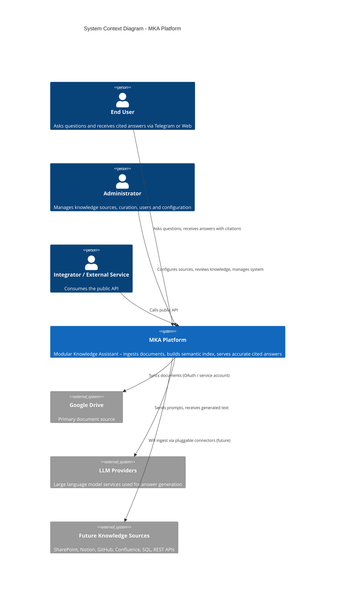

# C4 Context Diagram – MKA Platform

## Notes

- MKA is the sole system boundary for knowledge processing, retrieval and generation.
- External systems interact only through well-defined interfaces (Drive API, LLM APIs, future connectors).
- End users never interact directly with internal stores or services.
- The architecture is prepared for additional knowledge sources without changing the core context.
