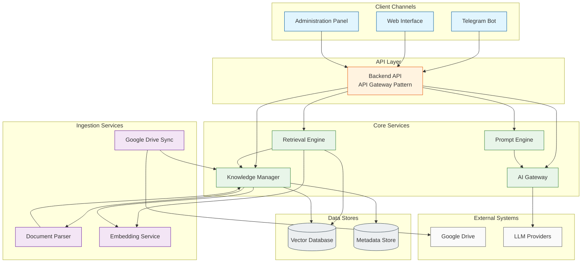

# Component Diagram – Module Boundaries

## Module Responsibility Matrix

| Module                 | Primary Responsibility                                                                 | Key Interfaces (conceptual)                          | Allowed Dependencies                  |
|------------------------|----------------------------------------------------------------------------------------|------------------------------------------------------|---------------------------------------|
| **Backend API**        | Public entry point, authn/authz, rate limiting, request orchestration, response shaping | Public API, internal service contracts               | KM, RE, PE, AG                        |
| **Knowledge Manager**  | Document & chunk lifecycle, provenance, citation registry, sync state                  | Ingest API, Metadata API, Citation API               | DP (events), ES, VDB, MS              |
| **Google Drive Sync**  | Drive authentication, change detection, file acquisition                               | Drive connector, Ingest trigger                      | KM                                    |
| **Document Parser**    | Format-specific text & structure extraction (PDF, Office, MD, HTML, CSV, OCR)          | Parse request / result events                        | KM (result only)                      |
| **Embedding Service**  | Stateless vector production for text                                                   | Embed(text) → vector                                 | None (pure)                           |
| **Vector Database**    | Persistent vector storage and similarity search                                        | Upsert, Search, Delete by ID                         | None                                  |
| **Retrieval Engine**   | Query embedding, filtered semantic search, ranking, context window + citation assembly | Retrieve(query, filters) → ranked chunks + citations | ES, VDB, KM                           |
| **Prompt Engine**      | Template selection, context injection, citation instruction injection                  | BuildPrompt(question, context) → prompt              | None                                  |
| **AI Gateway**         | Provider abstraction, retries, timeouts, safety, token accounting                      | Generate(prompt) → text                              | External LLM providers                |
| **Telegram Bot**       | Protocol adaptation only                                                               | Telegram updates ↔ Backend API                       | Backend API only                      |
| **Web Interface**      | Presentation only                                                                      | HTTP/WS ↔ Backend API                                | Backend API only                      |
| **Administration Panel** | Admin presentation and workflow UI                                                   | HTTP ↔ Backend API                                   | Backend API only                      |

## Dependency Direction Rules (Enforced)

1. Clients → Backend API only.
2. Backend API → Core services only (no direct store access).
3. Ingestion is strictly forward: Sync → Parser → Embedding → Knowledge Manager → Stores.
4. Retrieval is strictly forward: Retrieval Engine → Embedding + Vector + Knowledge Manager.
5. Prompt Engine and AI Gateway have no knowledge of storage or ingestion.
6. No module may depend on a Client channel.
7. Circular dependencies are forbidden by construction.

These rules guarantee that the core remains domain-agnostic and that future domain adapters can be introduced without modifying the existing dependency graph.
