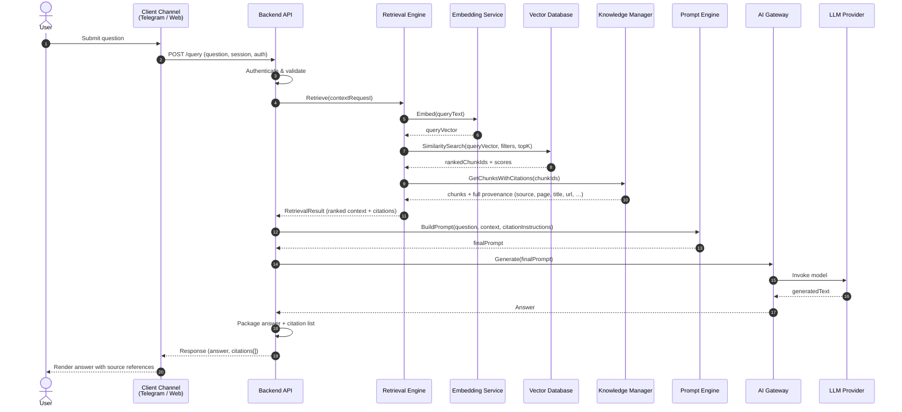

# Sequence Diagram – RAG Request Flow

## Flow Description

### 1. Ingress
- User interacts only with a Client Channel (Telegram Bot or Web Interface).
- Client performs minimal protocol adaptation and forwards the authenticated request to the Backend API.

### 2. Orchestration (Backend API)
- Single entry point enforces authentication, authorisation, rate limits and input validation.
- Delegates retrieval and generation; never accesses stores directly.

### 3. Retrieval
- Retrieval Engine owns the semantic search path.
- Obtains a query embedding from the Embedding Service (stateless).
- Executes similarity search against the Vector Database.
- Resolves full citation metadata through Knowledge Manager (single source of truth for provenance).
- Returns ranked chunks together with complete citation objects.

### 4. Prompt Construction
- Prompt Engine receives the original question and the retrieved context.
- Injects system instructions, context blocks and explicit citation requirements.
- Remains free of any storage or domain business logic.

### 5. Generation
- AI Gateway abstracts the concrete LLM provider.
- Handles retries, timeouts, safety filters and token accounting.
- Returns the raw generated text to the Backend API.

### 6. Response
- Backend API assembles the final payload: answer text + structured citation list.
- Client renders the answer and makes sources visible / navigable to the user.

## Key Invariants

- Every returned answer is accompanied by citations.
- Citation data originates exclusively from Knowledge Manager.
- No circular calls occur in the sequence.
- Ingestion path is completely separate and does not participate in the request flow.
- The sequence is identical regardless of the client channel (Telegram, Web, or future public API consumers).

## Error & Edge Paths (Conceptual)

- Authentication failure → 401 from Backend API.
- Empty retrieval → Prompt Engine still builds a prompt; answer may indicate insufficient knowledge (citation list empty).
- LLM failure → AI Gateway retries then surfaces a controlled error.
- Timeout → Backend API returns a graceful degradation response.

Detailed error contracts are out of scope for WO-001.
